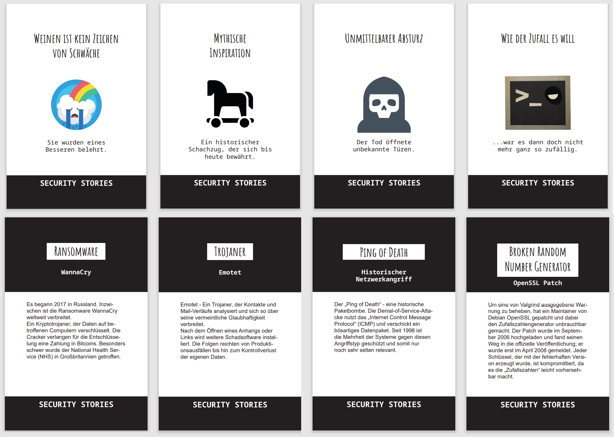

# Security Stories - Wahre Fälle der IT-Sicherheit

Ziel des Spiels ist es das Bewusstsein für IT-Sicherheit zu erhöhen.
Hierfür werden verschiedene Vorfälle aus dem Bereich IT-Sicherheit aufgegriffen und bearbeitet.

Die Regeln sind einfach:
- Der Moderator der jeweiligen Story nimmt eine Karte vom Stapel und liest die Überschrift und den Hinweis der 
Deckkarte vor
- Auf der Rückseite der Karte befindet sich die Auflösung, die nur der Moderator lesen darf
- Der Rest der Gruppe stellt anschließend Fragen 
- Fragen müssen so formuliert sein, dass der Moderator nur mit JA oder NEIN antworten kann
- Mit den richtigen Fragen tastet sich die Gruppe an die Lösung heran.
- Sobald der Vorfall in seinen Grundzügen rekonstruiert wurde, kann der Moderator die Rückseite für alle vorlesen und das Rätsel auflösen.
- Wie tiefgehend der Fall rekonstruiert werden muss und welche Details benötigt werden kann der Moderator entscheiden um den Schwierigkeitsgrad festzulegen

<table align="center"><tr><td align="center" width="9999">
</img>
</td></tr></table>

## License

 This work is licensed under a <a rel="license" href="http://creativecommons.org/licenses/by-nc-sa/4.0/">Creative Commons Attribution-NonCommercial-ShareAlike 4.0 International License</a>.
